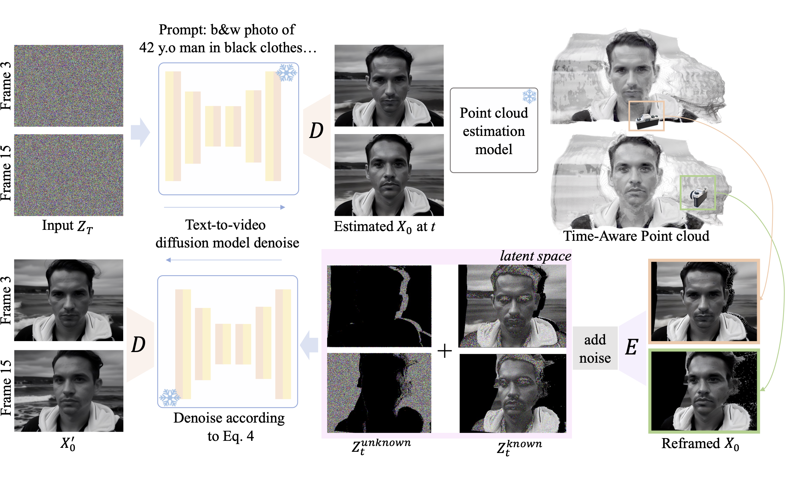
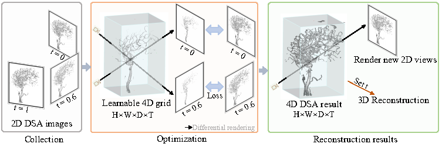
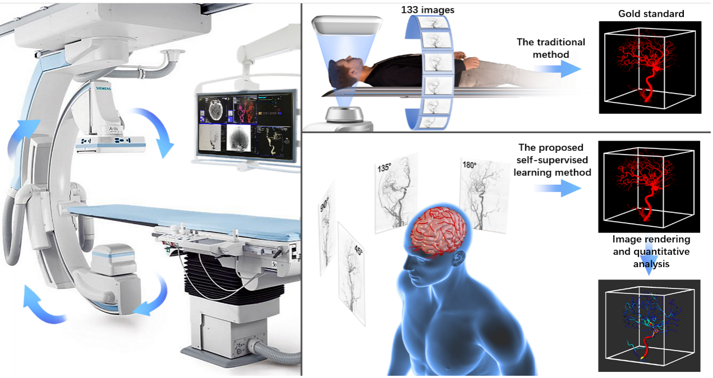

👋 Hi, I am Zhenghong Zhou(周政宏), a second-year Ph.D. student in the Department of Computer Science, University of Rochester, supervised by Prof. [Jiebo Luo](https://www.cs.rochester.edu/u/jluo/). I completed my M.S. and B.E. degree at Huazhong University of Science and Technology (HUST), supervised by Prof. [Xinggang Wang](https://xwcv.github.io/) and Prof. [Wenyu Liu](https://eic.hust.edu.cn/professor/liuwenyu/).

I am interested in video diffusion models, 3D/4D generation and reconstruction. 

Publications and Preprints
======
\* indicates equal contribution.

* **Latent-Reframe: Enabling Camera Control for Video Diffusion Model without Training**  
  **Zhenghong Zhou**\*, Jie An\*, Jiebo Luo  
  **ICCV, 2025**   
  [paper](https://arxiv.org/abs/2412.06029), [project page](https://latent-reframe.github.io/)  
  

    
  
  

* **TinyCLIP: CLIP Distillation via Affinity Mimicking and Weight Inheritance**  
  Kan Wu\*, Houwen Peng\*, **Zhenghong Zhou**\*, Bin Xiao, Mengchen Liu, Lu Yuan, Hong Xuan, Michael Valenzuela, Xi (Stephen) Chen, Xinggang Wang, Hongyang Chao, Han Hu  
  **ICCV, 2023**   
  [paper](https://openaccess.thecvf.com/content/ICCV2023/html/Wu_TinyCLIP_CLIP_Distillation_via_Affinity_Mimicking_and_Weight_Inheritance_ICCV_2023_paper.html), [code](https://github.com/microsoft/Cream/tree/main/TinyCLIP)  
  

    
  
  
* **TiAVox: Time-aware Attenuation Voxels for Sparse-view 4D DSA Reconstruction**  
  **Zhenghong Zhou**\*, Huangxuan Zhao\*, Jiemin Fang, Dongqiao Xiang, Lei Chen, Lingxia Wu, Feihong Wu, Wenyu Liu, Chuansheng Zheng, Xinggang Wang  
  **Arxiv, 2023**   
  [paper](https://arxiv.org/abs/2309.02318)  
  

    
  
    
* **Self-supervised Learning Enables Excellent 3d Digital Subtraction Angiography Reconstruction from Ultra-sparse 2d Projection**  
  Huangxuan Zhao\*, **Zhenghong Zhou**\*, Feihong Wu\*, Dongqiao Xiang\*, Hui Zhao, Wei Zhang, Lin Li, Zhong Li, Jia Huang, Hongyao Hu, Chengbo Liu, Tao Wang, Wenyu Liu, Jinqiang Ma, Fan Yang, Xinggang Wang, Chuansheng Zheng  
  **Cell Reports Medicine, 2022**  
  [paper](https://www.sciencedirect.com/science/article/pii/S2666379122003305), [code](https://github.com/zhouzhenghong-gt/self-supervised-3D-DSA-reconstructio-network)  
  

    
  
  

Internship
======
* [Adobe Research](https://research.adobe.com/), Seattle, US. 5,2025-Now  
  Research intern, mentored by Dr. [Yuqian Zhou](https://yzhouas.github.io/), working on controllbale video diffusion models

* [Microsoft Research Asia](https://www.msra.cn/), Beijing, China. Dec,2022-Jun,2023  
  Research intern, mentored by Dr. [Houwen Peng](https://houwenpeng.com/), working on visual-language models

Miscellaneous
======
Love badmintion, tennis, anime
 

> _Art is an explosion!_
> 
> --- _Deidara_
